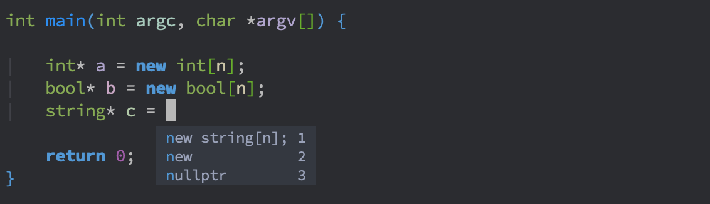
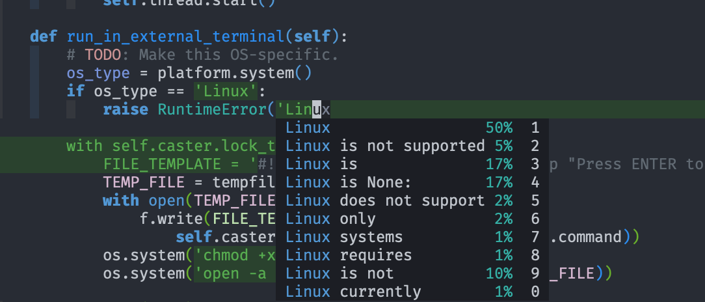
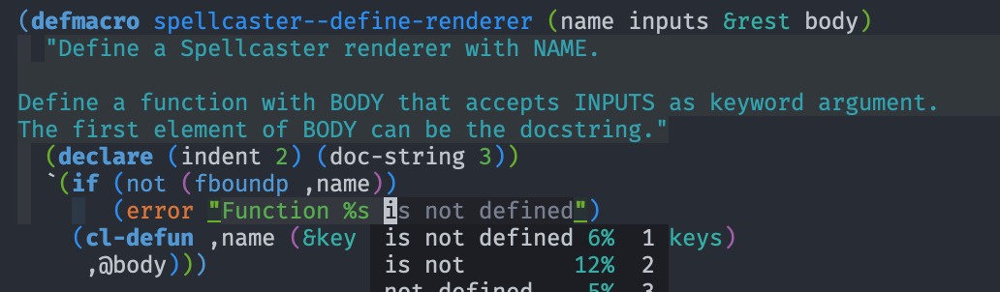
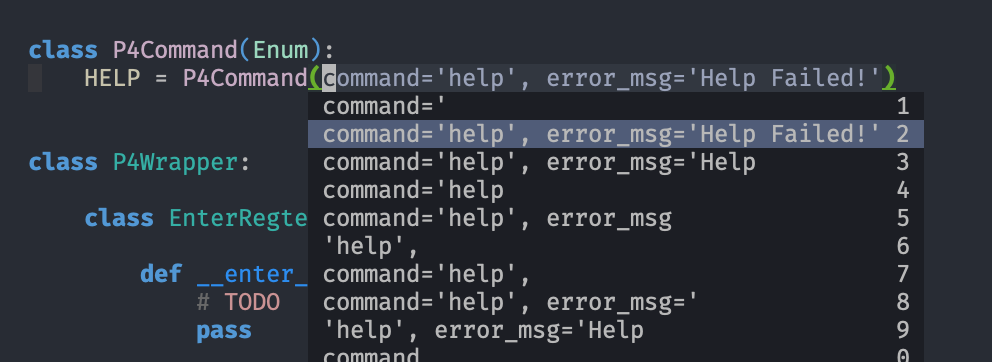

# company-tabnine

[](https://melpa.org/#/company-tabnine)

[TabNine](https://tabnine.com/) is the all-language autocompleter. It uses machine learning to provide responsive, reliable, and relevant suggestions.

`company-tabnine` provides TabNine completion backend for [company-mode](https://github.com/company-mode/company-mode). **It takes care of TabNine binaries**, so installation is easy.



With [Deep TabNine](https://tabnine.com/blog/deep):





## Installation

1. Make sure [company-mode](https://github.com/company-mode/company-mode) is installed and configured.

2. Install `company-tabnine`. This package is part of [MELPA](https://melpa.org).

   Note: See https://melpa.org/#/getting-started for MELPA usage. **Make sure to use the "bleeding-edge" repository instead of MELPA stable.**

   - With [use-package](https://github.com/jwiegley/use-package)

     Put the following in your config:

     ```emacs
     (use-package company-tabnine :ensure t)
     ```

   - With `package.el` (built-in)

     Install the package:
     ```emacs
     M-x package-install RET company-tabnine RET
     ```

     Put the following in your config:
     ```emacs
     (require 'company-tabnine)
     ```

3. Add `company-tabnine` to `company-backends`
   ```emacs
   (add-to-list 'company-backends #'company-tabnine)
   ```

4. Run `M-x company-tabnine-install-binary` to install the TabNine binary for your system.

## Recommended Configuration

Below are some recommended `company-mode` configuration that works well with `company-tabnine`.

```emacs
;; Trigger completion immediately.
(setq company-idle-delay 0)

;; Number the candidates (use M-1, M-2 etc to select completions).
(setq company-show-numbers t)
```

## Usage

`company-tabnine` should work out of the box.

See `M-x customize-group RET company-tabnine RET` for customizations.

### Auto-balance parentheses

TabNine can automatically balance parentheses, by removing and adding closing parentheses after the cursor. See the examples [here](https://github.com/zxqfl/TabNine/blob/master/HowToWriteAClient.md).

Note: The automatically-balancing happens in company's `post-completion` hook. However, `company-tng-frontend` actually suppresses this hook. In order to use automatic parentheses balancing, you need to manually call `company-complete-selection` or similar commands in this case, which will almost always happen if you do not use `company-tng-frontend`.

## Known Issues

- `company-transformers` or plugins that use it (such as `company-flx-mode`) can interfere with TabNine's sorting. If this happens, put the following temporary workaround in your config:

    ```emacs
    ;; workaround for company-transformers
    (setq company-tabnine--disable-next-transform nil)
    (defun my-company--transform-candidates (func &rest args)
      (if (not company-tabnine--disable-next-transform)
          (apply func args)
        (setq company-tabnine--disable-next-transform nil)
        (car args)))

    (defun my-company-tabnine (func &rest args)
      (when (eq (car args) 'candidates)
        (setq company-tabnine--disable-next-transform t))
      (apply func args))

    (advice-add #'company--transform-candidates :around #'my-company--transform-candidates)
    (advice-add #'company-tabnine :around #'my-company-tabnine)
    ```

- Spacemacs configurations can override the settings for `company-backends`.

- Conflict with ESS: See https://github.com/emacs-ess/ESS/issues/955

- TabNine's local deep learning completion might be enabled by default. It is very CPU-intensive if your device can't handle it. You can check by typing "TabNine::config" in any buffer (your browser should then automatically open to TabNine's config page) and disable Deep TabNine Local (you will lose local deep learning completion).
